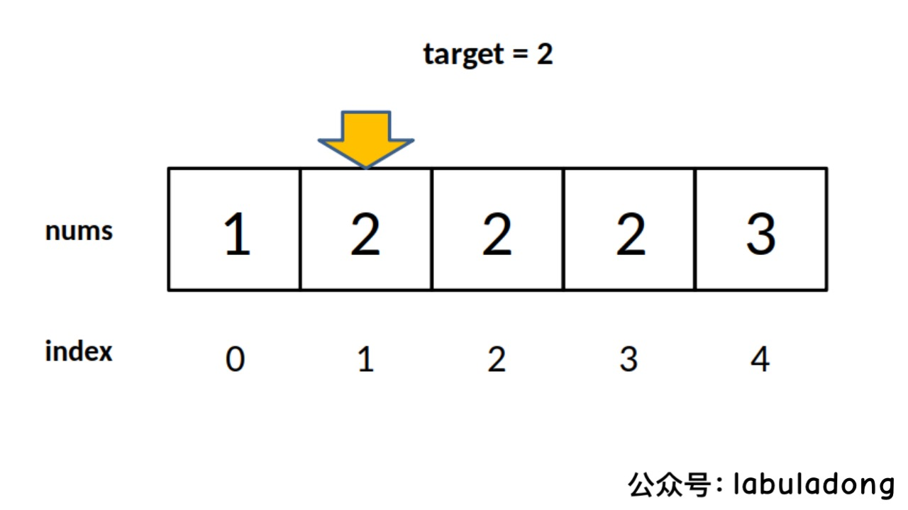

## [二分查找详解](https://github.com/labuladong/fucking-algorithm/blob/master/%E7%AE%97%E6%B3%95%E6%80%9D%E7%BB%B4%E7%B3%BB%E5%88%97/%E4%BA%8C%E5%88%86%E6%9F%A5%E6%89%BE%E8%AF%A6%E8%A7%A3.md) —— 思路很简单，细节是魔鬼

- [总体框架](#二分查找框架)
- [基本场景——寻找一个数](#寻找一个数（基本的二分搜索）)
- [寻找左侧边界](#二、寻找左侧边界的二分搜索)

> 一个**笑话**：有一天阿东到图书馆借了 N 本书，出图书馆的时候，警报响了，于是保安把阿东拦下，要检查一下哪本书没有登记出借。阿东正准备把每一本书在报警器下过一下，以找出引发警报的书，但是保安露出不屑的眼神：你连二分查找都不会吗？于是保安把书分成两堆，让第一堆过一下报警器，报警器响；于是再把这堆书分成两堆…… 最终，检测了 logN 次之后，保安成功的找到了那本引起警报的书，露出了得意和嘲讽的笑容。于是阿东背着剩下的书走了。
> 
> 从此，图书馆丢了 N - 1 本书。

本文就来探究几个**最常用的二分查找场景：寻找一个数、寻找左侧边界、寻找右侧边界**。而且，我们就是要深入细节，比如不等号是否应该带等号，mid 是否应该加一等等。分析这些细节的差异以及出现这些差异的原因，保证你能灵活准确地写出正确的二分查找算法。

### 二分查找框架
```java
//java
int binarySearch(int[] nums, int target) {
    int left = 0, right = ...;

    while(...) {
        int mid = left + (right - left) / 2;
        if (nums[mid] == target) {
            ...
        } else if (nums[mid] < target) {
            left = ...
        } else if (nums[mid] > target) {
            right = ...
        }
    }
    return ...;
}
```

```py
# python
def binarySearch(nums, target):
    left , right = 0 , ...

    while ... :
        mid = left + (right-left)/2
        if nums[mid] == target:
            ...
        elif nums[mid] < target:
            left = ...
        elif nums[mid] > target:
            right = ...

    return ...
```
**分析二分查找的一个技巧是：不要出现 `else`，而是把所有情况用 `else if` 写清楚，这样可以清楚地展现所有细节。**  

> 一般计算 mid 时需要防止溢出，代码中 left + (right - left) / 2 就和 (left + right) / 2 的结果相同，但是有效防止了 left 和 right 太大直接相加导致溢出。

### 寻找一个数（基本的二分搜索）
最简单的场景，即搜索一个数，如果存在，返回其索引，否则返回 -1。
```java
// java版
int binarySearch(int[] nums, int target) {
    int left = 0; 
    int right = nums.length - 1; // 注意

    while(left <= right) {
        int mid = left + (right - left) / 2;
        if(nums[mid] == target)
            return mid; 
        else if (nums[mid] < target)
            left = mid + 1; // 注意
        else if (nums[mid] > target)
            right = mid - 1; // 注意
    }
    return -1;
}
```

```py
# python版
def binarySearch(nums, target):
    left , right = 0 , len(nums)-1 #注意

    while left<=right:
        mid = left + (right-left)/2
        if nums[mid] == target:
            return mid
        elif nums[mid] < target:
            left = mid+1    #注意
        elif nums[mid] > target:
            right = mid-1   #注意
    
    return -1   
```

#### 1、为什么 `while` 循环的条件中是 `<=`，而不是 `<`？
答：因为初始化 `right` 的赋值是 `nums.length - 1`，即最后一个元素的索引，而不是 `nums.length`。

这二者可能出现在不同功能的二分查找中，区别是：前者相当于两端都闭区间 `[left, right]`，后者相当于左闭右开区间 `[left, right)`，因为索引大小为 `nums.length` 是越界的。

什么时候应该停止搜索呢？当然，找到了目标值的时候可以终止：
```py
if nums[mid] == target:
    return mid; 
```

但如果没找到，就需要 `while` 循环终止，然后返回 `-1`。

- `while(left <= right)` 的终止条件是 `left == right + 1`，写成区间的形式就是 `[right + 1, right]`，或者带个具体的数字进去 `[3, 2]`，可见这时候区间为空，因为没有数字既大于等于 `3` 又小于等于 `2` 的吧。所以这时候 `while` 循环终止是正确的，直接返回 `-1` 即可。

- `while(left < right)` 的终止条件是 `left == right`，写成区间的形式就是 `[left, right]`，或者带个具体的数字进去 `[2, 2]`，这时候区间非空，还有一个数 `2`，但此时` while` 循环终止了。也就是说这区间 `[2, 2]` 被漏掉了，索引 `2` 没有被搜索，如果这时候直接返回 `-1` 就是错误的。

> 当然，如果非要用 `while(left < right)` 也可以，我们已经知道了出错的原因，就打个补丁（结束循环时进行一次`if nums[left] == target`判断）好了

```java
// java
    //...
    while(left < right) {
        // ...
    }
    return nums[left] == target ? left : -1;
```

#### 2、为什么是`left = mid + 1`，`right = mid - 1`？
答：本算法的搜索区间是两端都闭的，即 `[left, right]`。那么当我们发现索引 `mid` 不是要找的 `target` 时，下一步应该去搜索`[left, mid-1]` 或者 `[mid+1, right]` 。因为 `mid` 已经搜索过，应该从搜索区间中去除。

#### 3、算法有什么缺陷？
答：这个算法存在局限性。

比如说给你有序数组 `nums = [1,2,2,2,3]`，`target` 为 `2`，此算法返回的索引是 `2`，没错。但是如果我想得到 `target` 的左侧边界，即索引 `1`，或者我想得到 `target` 的右侧边界，即索引 `3`，这样的话此算法是无法处理的。

这样的需求很常见，也可以找到一个 `target`，然后向左或向右线性搜索。但是这样难以保证二分查找对数级的复杂度了。

### 二、寻找左侧边界的二分搜索
常见的代码形式:
```java
int left_bound(int[] nums, int target) {
    if (nums.length == 0) return -1;
    int left = 0;
    int right = nums.length; // 注意
    
    while (left < right) { // 注意
        int mid = (left + right) / 2;
        if (nums[mid] == target) {
            right = mid;
        } else if (nums[mid] < target) {
            left = mid + 1;
        } else if (nums[mid] > target) {
            right = mid; // 注意
        }
    }
    return left;
}
```

#### 1、为什么 while 中是 < 而不是 <=?
答：与上述分析方法相同，主要因为 `right = nums.length` 而不是 `nums.length - 1`。因此每次循环的「搜索区间」是 `[left, right)` 左闭右开。

`while(left < right)` 终止的条件是 `left == right`，此时搜索区间 `[left, left)` 为空，所以可以正确终止。

#### 2、为什么没有返回 `-1` 的操作？如果 `nums` 中不存在 `target `这个值，怎么办？

答：因为要一步一步来，先理解一下这个「左侧边界」有什么特殊含义：



对于这个数组，算法会返回` 1`。这个 `1` 的含义可以这样解读：`nums` 中小于 `2` 的元素有 `1 `个。

比如对于有序数组 `nums = [2,3,5,7], target = 1`，算法会返回 `0`，含义是：`nums` 中小于 `1` 的元素有 `0` 个。

再比如说` nums = [2,3,5,7], target = 8`，算法会返回 4，含义是：nums 中小于 8 的元素有 4 个。

综上可以看出，函数的返回值（即 `left` 变量的值）取值区间是闭区间 `[0, nums.length]`，所以我们简单添加两行代码就能在未成功查找的时候 `return -1`：
```c++
while (left < right) {
    //...
}
// target 比所有数都大
if (left == nums.length) return -1;
// 类似之前算法的处理方式
return nums[left] == target ? left : -1;
```

#### 3、为什么 `left = mid + 1`，`right = mid` ？和之前的算法不一样？

答：因为我们的「搜索区间」是 `[left, right)` 左闭右开，所以当 `nums[mid]` 被检测之后，下一步的搜索区间应该去掉 `mid` 分割成两个区间，即` [left, mid)` 或 `[mid + 1, right)`。

#### 4、为什么该算法能够搜索左侧边界？

答：关键在于对于 `nums[mid] == target` 这种情况的处理：
```c++
    if (nums[mid] == target)
        right = mid;
```
可见，找到 `target` 时不要立即返回，而是缩小「搜索区间」的上界 `right`，在区间 `[left, mid)` 中继续搜索，即不断向左收缩，达到锁定左侧边界的目的。

#### 5、为什么返回 `left` 而不是 `right`？

答：都是一样的，因为 `while `终止的条件是 `left == right`。

#### 6、能不能想办法把 `right` 变成 `nums.length - 1`，也就是继续使用两边都闭的「搜索区间」？这样就可以和第一种二分搜索在某种程度上统一起来了。
答：当然可以，只要你明白了「搜索区间」这个概念，就能有效避免漏掉元素，随便你怎么改都行。

由于`right`初始化为`nums.length - 1`，`while `的终止条件应该是 `left == right + 1`，也就是其中应该用 `<=`：
```c++
int left_bound(int[] nums, int target) {
    // 搜索区间为 [left, right]
    int left = 0, right = nums.length - 1;
    while (left <= right) {
        int mid = left + (right - left) / 2;
        // if else ...
    }
```

因为搜索区间是两端都闭的，且现在是搜索左侧边界，所以 `left` 和 `right` 的更新逻辑如下：
```c++
if (nums[mid] < target) {
    // 搜索区间变为 [mid+1, right]
    left = mid + 1;
} else if (nums[mid] > target) {
    // 搜索区间变为 [left, mid-1]
    right = mid - 1;
} else if (nums[mid] == target) {
    // 收缩右侧边界
    right = mid - 1;
}
```

由于 `while `的退出条件是 `left == right + 1`，所以当 `target `比 `nums` 中所有元素都大时，会存在以下情况使得索引越界：


最后返回结果的代码应该检查越界情况：
```c++
if (left >= nums.length || nums[left] != target)
    return -1;
return left;
```

完整代码如下：
```c++
int left_bound(int[] nums, int target) {
    int left = 0, right = nums.length - 1;
    // 搜索区间为 [left, right]
    while (left <= right) {
        int mid = left + (right - left) / 2;
        if (nums[mid] < target) {
            // 搜索区间变为 [mid+1, right]
            left = mid + 1;
        } else if (nums[mid] > target) {
            // 搜索区间变为 [left, mid-1]
            right = mid - 1;
        } else if (nums[mid] == target) {
            // 收缩右侧边界
            right = mid - 1;
        }
    }
    // 检查出界情况
    if (left >= nums.length || nums[left] != target)
        return -1;
    return left;
}
```

### 三、寻找右侧边界的二分查找
类似寻找左侧边界的算法
```c++
int right_bound(int[] nums, int target) {
    if (nums.length == 0) return -1;
    int left = 0, right = nums.length;
    
    while (left < right) {
        int mid = (left + right) / 2;
        if (nums[mid] == target) {
            left = mid + 1; // 注意
        } else if (nums[mid] < target) {
            left = mid + 1;
        } else if (nums[mid] > target) {
            right = mid;
        }
    }
    return left - 1; // 注意
}
```

### 四、逻辑统一

#### 第一个，最基本的二分查找算法：
因为我们初始化 `right = nums.length - 1`

所以决定了我们的「搜索区间」是` [left, right]`

所以决定了 `while (left <= right)`

同时也决定了 `left = mid+1 `和 `right = mid-1`

因为我们只需找到一个 `target` 的索引即可

所以当 `nums[mid] == target` 时可以立即返回

#### 第二个，寻找左侧边界的二分查找：
因为我们初始化 `right = nums.length`

所以决定了我们的「搜索区间」是 `[left, right)`

所以决定了 `while (left < right)`

同时也决定了 `left = mid + 1 `和 `right = mid`

因为我们需找到`target` 的最左侧索引

所以当` nums[mid] == target `时不要立即返回

而要收紧右侧边界以锁定左侧边界

#### 第三个，寻找右侧边界的二分查找：
因为我们初始化 `right = nums.length`

所以决定了我们的「搜索区间」是` [left, right)`

所以决定了` while (left < right)`

同时也决定了 `left = mid + 1 `和 `right = mid`

因为我们需找到 `target `的最右侧索引

所以当` nums[mid] == target` 时不要立即返回

而要收紧左侧边界以锁定右侧边界

又因为收紧左侧边界时必须 `left = mid + 1`

所以最后无论返回 `left` 还是 `right`，必须减一