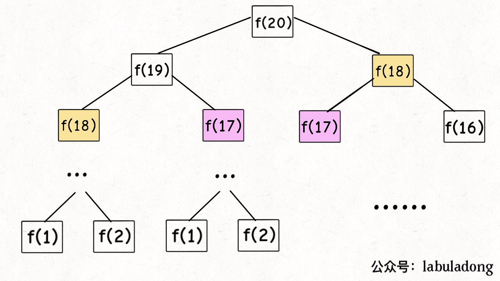
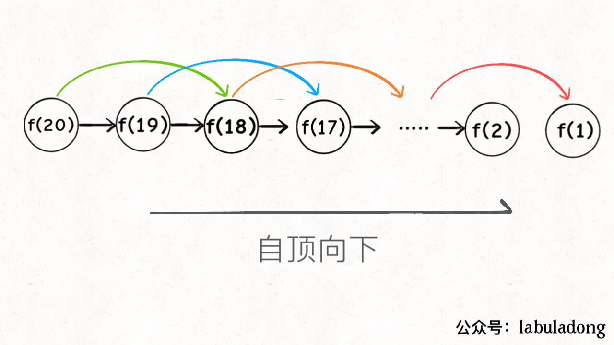
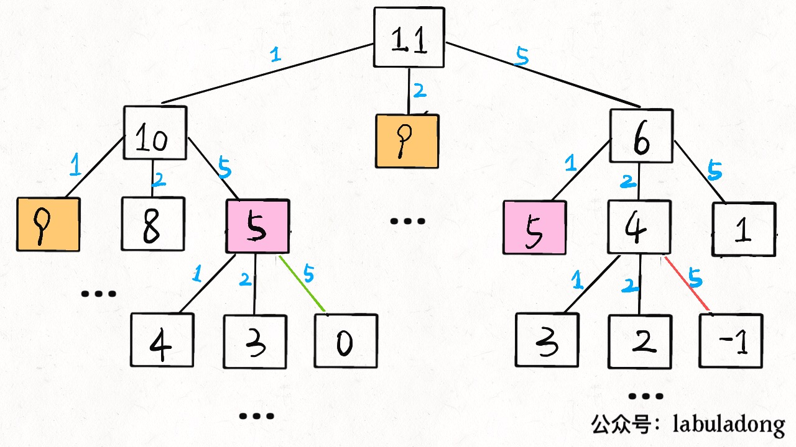
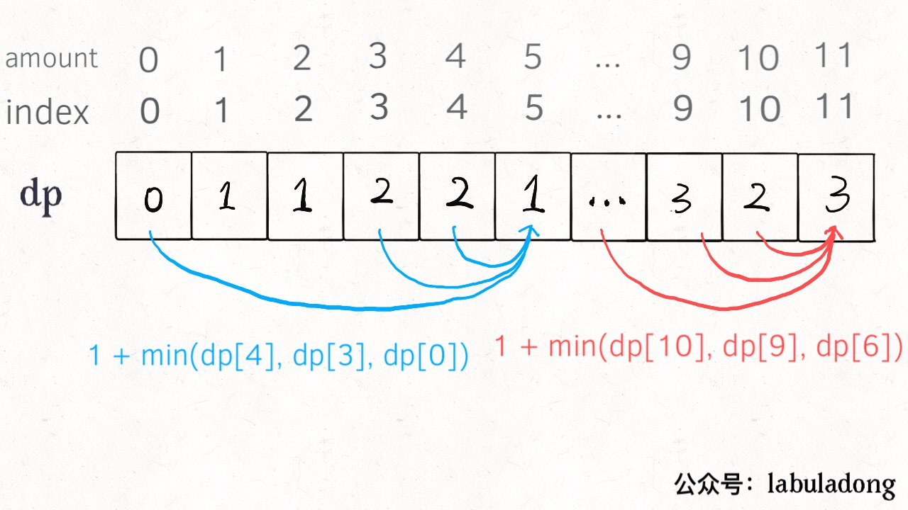

## [动态规划(Dynamic Programming)详解](https://github.com/labuladong/fucking-algorithm/blob/master/%E5%8A%A8%E6%80%81%E8%A7%84%E5%88%92%E7%B3%BB%E5%88%97/%E5%8A%A8%E6%80%81%E8%A7%84%E5%88%92%E8%AF%A6%E8%A7%A3%E8%BF%9B%E9%98%B6.md)
- [斐波那契数列](#斐波那契数列问题——重叠子问题)
  - [暴力递归](#1、暴力递归)
  - [备忘录的递归解法](#2、带备忘录的递归解法)
  - [dp table解法](#3、dp数组的迭代解法)
  - [细节优化](#进一步优化)
- [凑零钱问题](#凑零钱问题——最优子结构)
  - [暴力递归](#暴力递归)
  - [备忘录递归](#备忘录递归)
  - [dp数组](#dp数组)
- [总结](#总结)

**动态规划问题的一般形式就是求最值**。比如，求**最长**递增子序列，**最小**距离等

**求解动态规划的核心问题是穷举**。因为求最值，也就是把所有可行答案穷举，然后找到最值。

>> 动态规划的穷举不同之处在于此类问题**存在「重叠子问题」**，如果暴力穷举会导致效率极其低下，所以需要「备忘录」或「DP table」来优化穷举过程，避免不必要的计算（重复的计算）

而且，动态规划问题一定会**具备「最优子结构」**，才可以通过子问题的最值得到原问题的最值。

另外，虽然动态规划的核心思想就是穷举求最值，但是问题可以千变万化，穷举所有可行解其实并不是一件容易的事，只有列出**正确的「状态转移方程」**才能正确地穷举。

- 以上提到的，就是动态规划三要素：重叠子问题、最优子结构、状态转移方程。
> **写出状态转移方程是最困难的**

## 斐波那契数列问题——重叠子问题
> 注：斐波那契数列严格来说不是动态规划问题，这里用于说明什么是**重叠子问题**

### 1、暴力递归

斐波那契数列的数学形式就是递归的，写成代码就是这样：

```py
def fib(N):
    if N == 1 or N == 2:
        return 1
    return fib(N-1) + fib(N-2)
```

假设$n = 20$，则其递归树为

> PS：但凡遇到需要递归的问题，最好都画出递归树，这对你分析算法的复杂度，寻找算法低效的原因都有巨大帮助。



**递归算法的时间复杂度 = 子问题个数 × 解决一个子问题需要的时间。**

子问题个数，即递归树中节点的总数。显然二叉树节点总数为指数级别，所以子问题个数为$O(2^{n})$。

解决一个子问题的时间，在本算法中，没有循环，只有 $f(n - 1) + f(n - 2)$一个加法操作，时间为$O(1)$。

所以，这个算法的时间复杂度为 $O(2^n)$，指数级别。

观察递归树，很明显发现了算法低效的原因：**存在大量重复计算**，比如 $f(18)$被计算了两次，而且你可以看到，以 $f(18)$ 为根的这个递归树体量巨大，多算一遍，会耗费巨大的时间。

这就是动态规划问题的**第一个性质：重叠子问题**。下面，我们想办法解决这个问题。

### 2、带备忘录的递归解法

即然耗时的原因是重复计算，那么我们可以造一个「备忘录」，每次算出某个子问题的答案后别急着返回，先记到「备忘录」里再返回；每次遇到一个子问题先去「备忘录」里查一查，如果发现之前已经解决过这个问题了，直接把答案拿出来用，不要再耗时去计算了。

可以使用数组作为「备忘录」，或者哈希表（字典）
```py
from collections import defaultdict

class fib(object):
    def __init__(self):
        self.merry = defaultdict(int)
        self.merry[1] = 1
        self.merry[2] = 1
    
    def fun(self, N):
        if self.merry[N]:
            return self.merry[N]
        
        self.merry[N] = self.fun(N-1) + self.fun(N-2)
        return self.merry[N]
```
> $n=20$时提高了70倍

实际上，带「备忘录」的递归算法，把一棵存在巨量冗余的递归树通过「剪枝」，改造成了一幅不存在冗余的递归图，极大减少了子问题（即递归图中节点）的个数。



子问题个数，即图中节点的总数，由于本算法不存在冗余计算，子问题就是 $f(1), f(2), f(3) ... f(20)$，数量和输入规模 $n = 20$ 成正比，所以子问题个数为 $O(n)$。

解决一个子问题的时间为 $O(1)$。

所以，本算法的时间复杂度是 $O(n)$。暴力算法为$O(2^n)$。

> PS：会有$O(n)$的空间开销，进一步[优化](#进一步优化)可使其将为$O(1)$

至此，带备忘录的递归解法的效率已经和迭代的动态规划解法一样了。实际上，这种解法和迭代的动态规划已经差不多了，只不过**这种方法叫做「自顶向下」，动态规划叫做「自底向上」**。

**什么是「自顶向下」？**注意我们刚才画的递归树（或者说图），是从上向下延伸，都是从一个规模较大的原问题比如说 $f(20)$，向下逐渐分解规模，直到 $f(1)$ 和 $f(2)$ 触底，然后逐层返回答案，这就叫「自顶向下」。

**什么是「自底向上」？**反过来，我们直接从最底下，最简单，问题规模最小的 $f(1)$ 和 $f(2)$ 开始往上推，直到推到我们想要的答案 $f(20)$，这就是动态规划的思路，这也是为什么动态规划一般都脱离了递归，而是由循环迭代完成计算。

### 3、dp数组的迭代解法
可以把上述「备忘录」独立出来成为一张表，叫做**DP table**，在这张表上完成「自底向上」的推算！
```py
import numpy as np
def fib(N):
    dp_table = np.zeros(N+1)
    dp_table[1] = dp_table[2] = 1

    for i in range(3,N+1):
        dp_table[i] = dp_table[i-1] + dp_table[i-2]

    return dp_table[N]
```


实际上，带备忘录的递归解法中的「备忘录」，最终完成后就是这个 DP table，所以说这两种解法其实是差不多的，大部分情况下，效率也基本相同。

这里，引出**「状态转移方程」**这个名词，实际上就是描述问题结构的数学形式：

$$
f(n) = 
\begin{cases}
1 , & \text{$n = 1,2$ }\\
f(n-1) + f(n-2) , & \text{$n > 2$ }
\end{cases}
$$

把 $f(n)$ 想做一个状态$n$，这个状态 $n$ 是由状态 $n - 1$ 和状态 $n - 2$ 相加转移而来，这就叫**状态转移**。

>>> 上面的几种解法中的所有操作，例如 `return f(n - 1) + f(n - 2)`，`dp[i] = dp[i - 1] + dp[i - 2]`，以及对备忘录或 DP table 的初始化操作，都是围绕这个方程式的不同表现形式。可见列出「状态转移方程」的重要性，它是解决问题的核心。很容易发现，其实状态转移方程直接代表着暴力解法。

**动态规划问题最困难的就是写出状态转移方程**，即这个暴力解。优化方法无非是用备忘录或者 DP table，再无奥妙可言。

### 进一步优化
根据斐波那契数列的状态转移方程，当前状态只和之前的两个状态有关，其实并不需要那么长的一个 DP table 来存储所有的状态，只要想办法存储之前的两个状态就行了。所以，可以进一步优化，**把空间复杂度降为 $O(1)$**：
```py
def fib(N):
    if N == 1 or N == 2:
        return 1
    
    prev , curr = 1,1
    for i in range(3,N+1):
        result = prev + curr
        prev , curr = curr , result

    return curr
```

## 凑零钱问题——最优子结构
**问题描述：**给$k$种面值的硬币，面值分别为$c_1,c_2,\dots,c_k$，每种硬币的数量无限；再给一个总金额$amount$，问**最少**需要几枚硬币凑出这个金额，如果不可能凑出，返回$-1$。

```py
def coinChange(coins, amount):

#coins 中是可选硬币面值，amount 是目标金额
```

> 如：给定$k=3$，面值分别为$1,2,5$，总金额$amount=11$。那么最少需要3枚硬币凑出总金额，即$11=5+5+1$。

计算机在解决该问题时，就是把所有可能的情况穷举出来，然后找到最少的情况。

### 暴力递归

首先，该问题是动态规划问题，因为它**具有「最优子结构」，即符合子问题间必须互相独立**。

> 比如说，你的原问题是考出最高的总成绩，那么你的子问题就是要把语文考到最高，数学考到最高…… 为了每门课考到最高，你要把每门课相应的选择题分数拿到最高，填空题分数拿到最高…… 当然，最终就是你每门课都是满分，这就是最高的总成绩。

> 得到了正确的结果：最高的总成绩就是总分。因为这个过程符合最优子结构，“每门科目考到最高”这些子问题是互相独立，互不干扰的。

> 但是，如果加一个条件：你的语文成绩和数学成绩会互相制约，此消彼长。这样的话，显然你能考到的最高总成绩就达不到总分了，按刚才那个思路就会得到错误的结果。因为子问题并不独立，语文数学成绩无法同时最优，所以最优子结构被破坏。

**为什么凑零钱问题符合最优子结构**？如你想求 $amount = 11$ 时的最少硬币数（**原问题**），如果你知道凑出 $amount = 10$ 的最少硬币数（**子问题**），你只需要把子问题的答案加一（再选一枚面值为 1 的硬币）就是原问题的答案，因为硬币的数量是没有限制的，子问题之间没有相互制，是互相独立的。

既然知道了这是个动态规划问题，就要思考**如何列出正确的状态转移方程**？

**先确定「状态」**，也就是原问题和子问题中变化的变量。由于硬币数量无限，所以唯一的状态就是目标金额 $amount$。

**然后确定 $dp$ 函数的定义**：当前的目标金额是 $n$，至少需要 $dp(n)$个硬币凑出该金额。

**然后确定「选择」并择优**，也就是对于每个状态，可以做出什么选择改变当前状态。具体到这个问题，无论当前的目标金额是多少，选择就是从面额列表 $coins$ 中选择一个硬币，然后目标金额就会减少。

**最后明确 base case**，显然目标金额为 0 时，所需硬币数量为 0；当目标金额小于 0 时，无解，返回 -1。

**状态转移方程**为，$dp(n)$表示总金额为$n$时，至少需要$dp(n)$个硬币


$$
dp(n) = 
\begin{cases}
0 , & n=0\\
-1, & n<0\\
min\left\{ dp(n-coin)+1 | coin \in coins \right\} , & n>0
\end{cases}
$$

如$amount=11,coins=\{1,2,5\}$时，递归树如下



```py
class coinChange(object):
    def __init__(self, coins, amount):
        self.coins = coins
        self.amount = amount

    def dp(self, n):
        if n == 0:
            return 0
        elif n < 0:
            return -1
        else:
            res = float('inf') #初始化正无穷
            for coin in self.coins:
                subproblem = self.dp(n - coin)
                if subproblem == -1:
                    continue
                res = min(res,1+subproblem)

            return res if res != float('inf') else 1

coins = [1,2,5]
amount = 13
x = coinChange(coins,amount)
print(x.dp(amount))
```

**时间复杂度分析：子问题总数 × 每个子问题的时间。**

子问题总数为递归树节点个数$O(n^k)$，是指数级别的。每个子问题中含有一个 $for$ 循环，复杂度为 $O(k)$。所以总时间复杂度为 $O(k × n^k)$，指数级别。

### 备忘录递归
```py
class coinChange(object):
    def __init__(self, coins, amount):
        self.coins = coins
        self.amount = amount
        self.memo = {
            0 : 0
        }

    def fun(self, n):
        if n in self.memo:
            return self.memo[n]

        if n < 0:
            return -1
        else:
            res = float('inf') #初始化正无穷
            for coin in self.coins:
                subproblem = self.dp(n - coin)
                if subproblem == -1:
                    continue
                res = min(res,1+subproblem)

            self.memo[n] = res if res != float('inf') else -1

            return self.memo[n]
```
子问题总数不会超过金额数 $n$，即子问题数目为 $O(n)$。处理一个子问题的时间不变，仍是 $O(k)$，所以总的时间复杂度是 $O(kn)$。

### dp数组
$dp[i] = x$ 表示，当目标金额为 i 时，至少需要 x 枚硬币。
```py
class coinChange(object):
    def __init__(self, coins, amount):
        self.coins = coins
        self.amount = amount
        self.memo = {
            0 : 0
        }

    def dp(self, n):
        if n < 0:
            return -1

        for i in range(n+1):
            for coin in self.coins:
                if i < coin:
                    continue
                self.memo[i] = min(self.memo[i],1+self.memo[i-coin])
        
        return self.memo[n]
```



## 总结
第一个斐波那契数列的问题，解释了如何通过「备忘录」或者「dp table」的方法来优化递归树，并且明确了这两种方法本质上是一样的，只是自顶向下和自底向上的不同而已。

第二个凑零钱的问题，展示了如何流程化确定「状态转移方程」，只要通过状态转移方程写出暴力递归解，剩下的也就是优化递归树，消除重叠子问题而已。

计算机解决问题其实没有任何奇技淫巧，它唯一的解决办法就是穷举，穷举所有可能性。算法设计无非就是先思考“如何穷举”，然后再追求“如何聪明地穷举”。

列出动态转移方程，就是在解决“如何穷举”的问题。之所以说它难，一是因为很多穷举需要递归实现，二是因为有的问题本身的解空间复杂，不那么容易穷举完整。

备忘录、DP table 就是在追求“如何聪明地穷举”。用空间换时间的思路，是降低时间复杂度的不二法门？