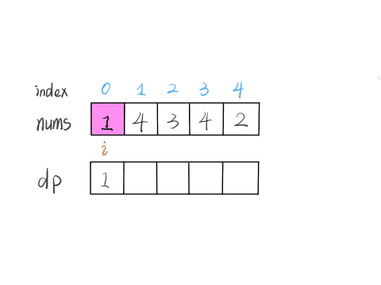

## 题目描述：


> 需要注意**子序列**与**子串**的区别，子串是连续的，而子序列不一定是连续的。

### 一、解法 —— 数学归纳法（核心思想）
在设计动态规划算法时，需要一个dp数组。那么，可以假设$dp[0,1,...,i-1]$都已经被计算好，然后怎样得到$dp[i]$

**首先定义dp数组**：$dp[i]$表示以$nums[i]$数为结尾的最长递增子序列的长度。



所以，最终结果（最长的递增子序列长度）是dp数组中的最大值

**当前需要解决的问题是**：如何已知$dp[0,...,4]$推出$dp[5]$的值，也就是以$nums[5]$为结尾的最长递增子序列。


$nums[5] = 3$，既然是递增子序列，我们只要找到前面那些结尾比 3 小的子序列，然后把 3 接到最后，就可以形成一个新的递增子序列，而且这个新的子序列长度加一。然后把最长的作为$dp[5]$的值。


> 注：图中dp数组应为[1,2,2,3,2,3]
```c++
for (int j = 0; j < i; j++) {
    if (nums[i] > nums[j]) 
        dp[i] = Math.max(dp[i], dp[j] + 1);
}
```

此时自然也就可以写出，$dp[4],dp[3]$的计算过程：
```c++
for (int i = 0; i < nums.length; i++) {
    for (int j = 0; j < i; j++) {
        if (nums[i] > nums[j]) 
            dp[i] = Math.max(dp[i], dp[j] + 1);
    }
}
```

完整代码如下：
```py
def lengthOfLIS(nums):
    dp = []
    for i in range(len(nums)):
        # 遍历整个数组
        dp.append(1)# 初始化dp[i]为1
        for j in range(i):
            # 根据dp[0,1,...,i-1]的结果确定dp[i]的值
            if nums[i] > nums[j]:   # 满足递增规则
                dp[i] = max(dp[i],dp[j]+1)

    return max(dp),dp

print(lengthOfLIS([1,4,3,4,2,3]))
>>> (3, [1, 2, 2, 3, 2, 3])
```
> dp 数组应该全部初始化为 1，因为子序列最少也要包含自己，所以长度最小为 1。
>    时间复杂度为O(n^2)

## 总结一下动态规划的设计流程：

首先明确 dp 数组所存数据的含义。这步很重要，如果不得当或者不够清晰，会阻碍之后的步骤。

然后根据 dp 数组的定义，运用数学归纳法的思想，假设 $dp[0...i-1]$ 都已知，想办法求出 $dp[i]$，一旦这一步完成，整个题目基本就解决了。

但如果无法完成这一步，很可能就是 dp 数组的定义不够恰当，需要重新定义 dp 数组的含义；或者可能是 dp 数组存储的信息还不够，不足以推出下一步的答案，需要把 dp 数组扩大成二维数组甚至三维数组。

最后想一想问题的 base case 是什么，以此来初始化 dp 数组，以保证算法正确运行。

### 二、解法 —— 二分查找