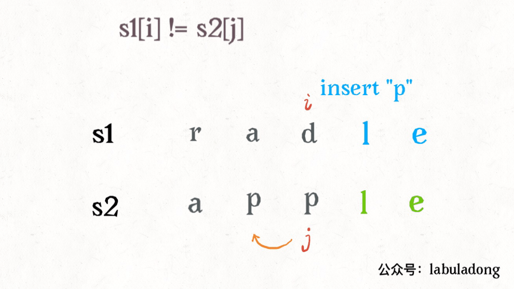

## 编辑距离
编辑距离问题就是给我们两个字符串 s1 和 s2，只能用三种操作（插入、删除、替换），让我们把 s1 变成 s2，求最少的操作数。


> 需要明确的是，不管是把 s1 变成 s2 还是反过来，结果都是一样的，所以后文就以 s1 变成 s2 举例。

### 思路
**解决两个字符串的动态规划问题**，一般都是用两个指针 i,j 分别指向两个字符串的最后，然后一步步往前走，缩小问题的规模。

设两个字符串分别为 "rad" 和 "apple"，为了把 s1 变成 s2，算法过程如下：


编辑距离为5


根据上面的 GIF，可以发现操作不只有三个，其实还有第四个操作，就是什么都不要做（skip）。因为两个字符本来就相同，为了使编辑距离最小，显然不应该对它们有任何操作，直接往前移动 i,j 即可。

还有一个很容易处理的情况，就是 j 走完 s2 时，如果 i 还没走完 s1，那么只能用删除操作把 s1 缩短为 s2。比如这个情况：


类似的，如果 i 走完 s1 时 j 还没走完了 s2，那就只能用插入操作把 s2 剩下的字符全部插入 s1。等会会看到，这两种情况就是算法的 **base case**。

### 代码详解
base case 是 i 走完 s1 或 j 走完 s2，可以直接返回另一个字符串剩下的长度。

对于每对字符` s1[i] `和 `s2[j]`，可以有四种操作：
```py
if s1[i] == s2[j]:
    啥都别做（skip）
    i, j 同时向前移动
else:
    三选一：
        插入（insert）
        删除（delete）
        替换（replace）
```

那么「**三选一**」到底该怎么选择呢？答案很简单，全试一遍，哪个操作最后得到的编辑距离最小，就选谁。

这里需要递归技巧，理解需要点技巧，先看下代码：
```py
def minDistance(s1, s2) -> int:

    def dp(i, j):
        # base case
        if i == -1: return j + 1
        if j == -1: return i + 1
        
        if s1[i] == s2[j]:
            return dp(i - 1, j - 1)  # 啥都不做
        else:
            return min(
                dp(i, j - 1) + 1,    # 插入
                dp(i - 1, j) + 1,    # 删除
                dp(i - 1, j - 1) + 1 # 替换
            )
    
    # i，j 初始化指向最后一个索引
    return dp(len(s1) - 1, len(s2) - 1)
```

这里 `dp(i, j)` 函数的定义是这样的：
```py
def dp(i, j) -> int
# 返回 s1[0..i] 和 s2[0..j] 的最小编辑距离
```

#### 如果 `s1[i] == s2[j]`:
```py
if s1[i] == s2[j]:
    return dp(i - 1, j - 1)  # 啥都不做
# 解释：
# 本来就相等，不需要任何操作
# s1[0..i] 和 s2[0..j] 的最小编辑距离等于
# s1[0..i-1] 和 s2[0..j-1] 的最小编辑距离
# 也就是说 dp(i, j) 等于 dp(i-1, j-1)
```

#### 如果 `s1[i]！=s2[j]`，就要对三个操作递归了：
```py
dp(i, j - 1) + 1,    # 插入
# 解释：
# 我直接在 s1[i] 插入一个和 s2[j] 一样的字符
# 那么 s2[j] 就被匹配了，前移 j，继续跟 i 对比
# 别忘了操作数加一
```


```py
dp(i - 1, j) + 1,    # 删除
# 解释：
# 我直接把 s[i] 这个字符删掉
# 前移 i，继续跟 j 对比
# 操作数加一
```

```py
dp(i - 1, j - 1) + 1 # 替换
# 解释：
# 我直接把 s1[i] 替换成 s2[j]，这样它俩就匹配了
# 同时前移 i，j 继续对比
# 操作数加一
```


>>> 还有点小问题就是，这个解法是暴力解法，存在重叠子问题，需要用动态规划技巧来优化。

### 动态规划优化
对于重叠子问题呢，[「动态规划学习」](./动态规划学习.md)介绍过，优化方法无非是备忘录或者 DP table。

#### 备忘录优化
```py
def minDistance(s1, s2) -> int:

    memo = dict() # 备忘录
    def dp(i, j):
        if (i, j) in memo: 
            return memo[(i, j)]
        ...
        
        if s1[i] == s2[j]:
            memo[(i, j)] = ...  
        else:
            memo[(i, j)] = ...
        return memo[(i, j)]
    
    return dp(len(s1) - 1, len(s2) - 1)
```

####  DP table优化
首先明确 dp 数组的含义，dp 数组是一个二维数组：


很容易理解`dp[..][0]` 和` dp[0][..]` 对应 base case，`dp[i][j]` 的含义和之前的 `dp` 函数类似：
```py
def dp(i, j) -> int
# 返回 s1[0..i] 和 s2[0..j] 的最小编辑距离

dp[i-1][j-1]
# 存储 s1[0..i] 和 s2[0..j] 的最小编辑距离
```

> 注意DP table 是自底向上求解，递归解法是自顶向下求解：
```c++
int minDistance(String s1, String s2) {
    int m = s1.length(), n = s2.length();
    int[][] dp = new int[m + 1][n + 1];
    // base case 
    for (int i = 1; i <= m; i++)
        dp[i][0] = i;
    for (int j = 1; j <= n; j++)
        dp[0][j] = j;
    // 自底向上求解
    for (int i = 1; i <= m; i++)
        for (int j = 1; j <= n; j++)
            if (s1.charAt(i-1) == s2.charAt(j-1))
                dp[i][j] = dp[i - 1][j - 1];
            else               
                dp[i][j] = min(
                    dp[i - 1][j] + 1,
                    dp[i][j - 1] + 1,
                    dp[i-1][j-1] + 1
                );
    // 储存着整个 s1 和 s2 的最小编辑距离
    return dp[m][n];
}

int min(int a, int b, int c) {
    return Math.min(a, Math.min(b, c));
}
```

### 三、扩展延伸
一般来说，处理两个字符串的动态规划问题，都是按本文的思路处理，建立 DP table。因为易于找出状态转移的关系，比如编辑距离的 DP table：


> 还有一个细节，既然每个 `dp[i][j]` 只和它附近的三个状态有关，空间复杂度是可以压缩成 $O(min(M, N))$ 的（M，N 是两个字符串的长度）。

这里**只求出了最小的编辑距离，那具体的操作是什么**？

代码稍加修改，给 dp 数组增加额外的信息即可：
```c++
// int[][] dp;
Node[][] dp;

class Node {
    int val;
    int choice;
    // 0 代表啥都不做
    // 1 代表插入
    // 2 代表删除
    // 3 代表替换
}
```

`val` 属性就是之前的 dp 数组的数值，`choice` 属性代表操作。在做最优选择时，顺便把操作记录下来，然后就从结果反推具体操作。

最终结果是` dp[m][n] `，这里的 `val `存着最小编辑距离，`choice `存着最后一个操作，比如说是插入操作，那么就可以左移一格：


重复此过程，可以一步步回到起点 dp[0][0]，形成一条路径，按这条路径上的操作进行编辑，就是最佳方案。
